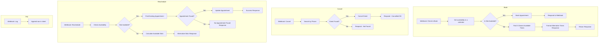

# Flow Diagram

```mermaid
flowchart TD
    subgraph Book
    A1[Webhook: Check & Book] --> A2[Get availability in a calendar]
    A2 --> A3{Is Slot Available?}
    A3 -->|Yes| A4[Book Appointment] --> A5[Respond to Webhook]
    A3 -->|No| A6[Find 3 Closest Available Times] --> A7[Format Alternative Times Response] --> A8[Return Response]
    end

    subgraph Cancel
    B1[Webhook: Cancel] --> B2[Search by Phone]
    B2 --> B3{Event Found?}
    B3 -->|Yes| B4[Cancel Event] --> B5[Respond - Cancelled OK]
    B3 -->|No| B6[Respond - Not Found]
    end

    subgraph Reschedule
    C1[Webhook: Reschedule] --> C2[Check Availability]
    C2 --> C3{Slot Available?}
    C3 -->|Yes| C4[Find Existing Appointment]
    C4 --> C5{Appointment Found?}
    C5 -->|Yes| C6[Update Appointment] --> C7[Success Response]
    C5 -->|No| C8[No Appointment Found Response]
    C3 -->|No| C9[Calculate Available Slots] --> C10[Alternative Slots Response]
    end

    subgraph Log
    D1[Webhook: Log] --> D2[Append row in sheet]
    end
```

Rendered automatically by GitHub when viewing this file.
